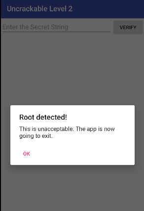
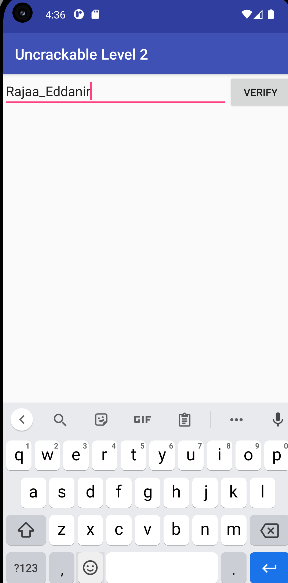

# Bypass de la Détection de Root Android avec Medusa

**Auteur :** Rajaa Eddanir  
**Outil principal :** Medusa (basé sur Frida)  
**Cible :** OWASP MASTG — UnCrackable Level 2 (`owasp.mstg.uncrackable2`)    

---


## Objectif

Réaliser, pas à pas, un bypass de la détection de root Android en utilisant Medusa, puis valider que l'application cible ne détecte plus le root au démarrage.

---

## Prérequis

- Python 3.x installé sur le poste de travail
- [Medusa](https://github.com/Ch0pin/medusa) installé et configuré
- Un appareil Android rooté (physique ou émulateur)
- `frida-server` compatible avec la version de Frida installée, déployé sur l'appareil
- ADB installé et fonctionnel
- L'APK `owasp.mstg.uncrackable2` installé sur l'appareil

---

## Environnement

| Élément | Valeur |
|---|---|
| Poste de travail | Windows (PowerShell) |
| Version Frida | 17.9.1 |
| Medusa | Version dev (124 modules disponibles) |

---

## Étape 1 — Vérifier l'installation de l'APK cible

Avant de lancer Medusa, vérifier que l'application cible est bien installée sur l'appareil.

Sur PowerShell (Windows), `grep` n'est pas disponible. Utiliser `Select-String` à la place :

```powershell
adb shell pm list packages | Select-String "uncrackable"
```

Résultat attendu :

```
package:owasp.mstg.uncrackable2
package:owasp.mstg.uncrackable3
```

Si l'application n'est pas installée :

```powershell
adb install UnCrackable-Level2.apk
```

---

## Étape 2 — Lancer Medusa et sélectionner le device

```bash
python medusa.py
```

Au démarrage, Medusa charge ses modules et liste les appareils disponibles :

```
[INFO] - Loading modules...
[INFO] - Total modules available 124
[INFO] - All one....

Available devices:
0) Device(id="local", name="Local System", type='local')
1) Device(id="socket", name="Local Socket", type='remote')

Enter the index of the device to use: 1
```

Sélectionner l'index correspondant au device Android (ici `1` pour le socket local).


---

## Étape 3 — Consulter l'aide de Medusa (optionnel)

Pour afficher toutes les options disponibles au lancement :

```bash
python medusa.py --help
```


Les options principales au lancement :

| Option | Description |
|---|---|
| `-r, --recipe` | Charger une session/recette sauvegardée |
| `-p, --package-name` | Nom du package à cibler |
| `-d, --device` | Device à utiliser |
| `-s, --save` | Fichier de log de sortie |
| `-t, --time` | Durée d'exécution sans interaction |

---

## Étape 4 — Comportement sans bypass (avant)

Sans le bypass actif, l'application détecte immédiatement le root au démarrage et affiche une alerte avant de se fermer.



> L'application affiche **"Root detected! This is unacceptable. The app is now going to exit."** et se ferme, rendant toute interaction impossible.

---

## Étape 5 — Rechercher et charger le module de bypass

Rechercher les modules disponibles pour la détection de root :

```
(socket) medusa➤ search root
```

Résultat :

```
root_detection/universal_root_detection_bypass
root_detection/rootbeer_detection_bypass
root_detection/rootbeer_detection_bypass_no_obfuscation
root_detection/jailMonkey_react_native
```

Charger le module universel :

```
(socket) medusa➤ use root_detection/universal_root_detection_bypass
```

Confirmation :

```
Current Mods:
0) root_detection/universal_root_detection_bypass
```


---

## Étape 6 — Lancer la session et attacher à l'application

Utiliser l'option `-f` pour spawner (démarrer) l'application directement depuis Medusa. Frida s'injecte avant que l'application n'initialise ses contrôles de sécurité.

```
(socket) medusa➤ run -f owasp.mstg.uncrackable2
```

Accepter la recompilation du script si demandé :

```
Module list has been modified, do you want to recompile? (Y/n) y
Script is compiled
```


---

## Étape 7 — Validation du bypass (après)

Une session active est confirmée par les messages suivants dans Medusa :

```
[INFO] - Spawned package : owasp.mstg.uncrackable2 on pid 24212
(in-session) type ? for options:➤
----------LOADING ANTI ROOT DETECTION SCRIPT--------------------
Loaded 15743 classes!
Bypass return value for binary: su
...
Bypass test-keys check
Bypass return value for binary: Superuser.apk
[!] overwriting is debugger connected
```

Sur l'appareil, l'application démarre normalement et affiche l'interface de saisie — sans aucune alerte de root :



> L'application **Uncrackable Level 2** s'ouvre normalement et permet la saisie. Le bypass est validé.

---

## Résumé — Avant / Après

| État | Comportement |
|---|---|
| Sans bypass | Alerte "Root detected!" au démarrage, l'app se ferme immédiatement |
| Avec bypass Medusa | L'app démarre normalement, toutes les vérifications de root sont neutralisées |

### Détail des vérifications bypassées

| Vérification | Résultat |
|---|---|
| Détection du binaire `su` | Bypassée |
| Vérification `test-keys` | Bypassée |
| Détection de `Superuser.apk` | Bypassée |
| Hook `isDebuggerConnected()` | Actif en continu |
| Application démarrée sans crash | Confirmée (PID assigné) |

> **Note :** Le message `[!] overwriting is debugger connected` répété en boucle est un comportement normal. UnCrackable Level 2 appelle `isDebuggerConnected()` de façon continue, et Medusa surécrit la valeur de retour à chaque appel.

---


## Référence des commandes Medusa

| Commande | Description |
|---|---|
| `search <terme>` | Rechercher un module par mot-clé |
| `use <module>` | Charger un module |
| `run -f <package>` | Spawner et attacher à l'application (recommandé) |
| `run -t` | Attacher à l'application en foreground |
| `run -w <package>` | Attendre le lancement de l'application puis s'attacher |
| `run -p <pid>` | Attacher à un processus existant par PID |
| `run --fallback` | Utiliser le mode fallback (CLI Frida) |
| `help run` | Afficher l'aide complète de la commande run |

---
